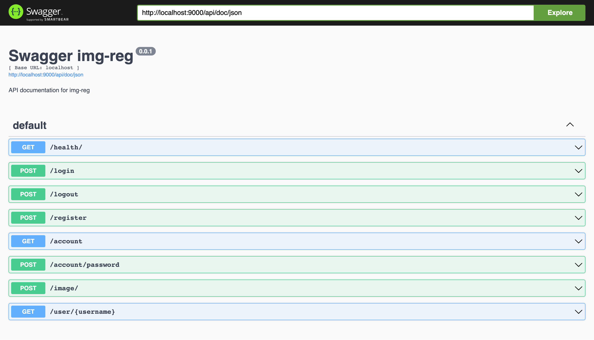

# WIP

Image registry application backend.

## Tech stack

-   Fastify (Node.js) in Typescript
-   Passport for session based authentication
-   Swagger for API documentation
-   MikroORM with PostgresQL database
-   AWS S3 blob storage (using localstack for development)
-   Docker compose for local development
-   Yarn 3 for package management

<!--  -->
